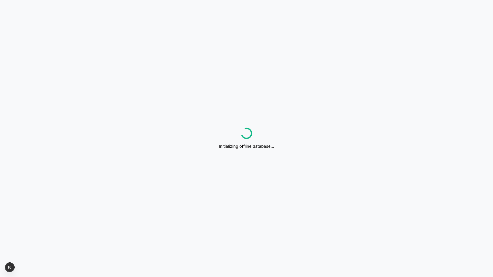
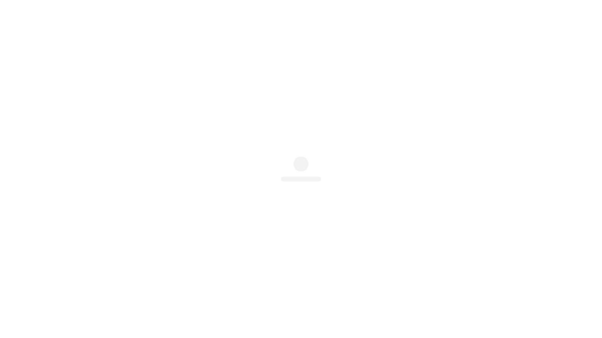
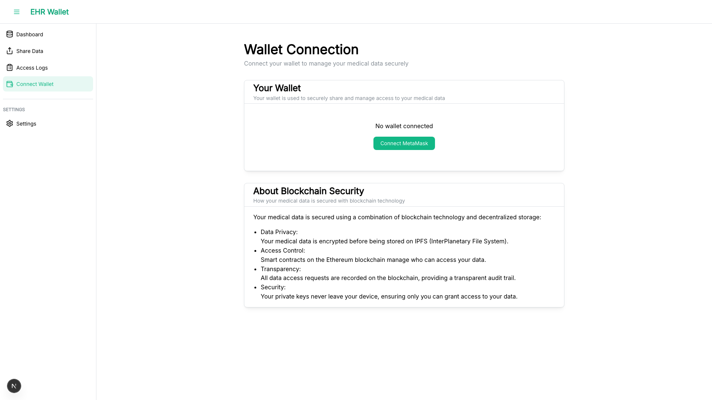
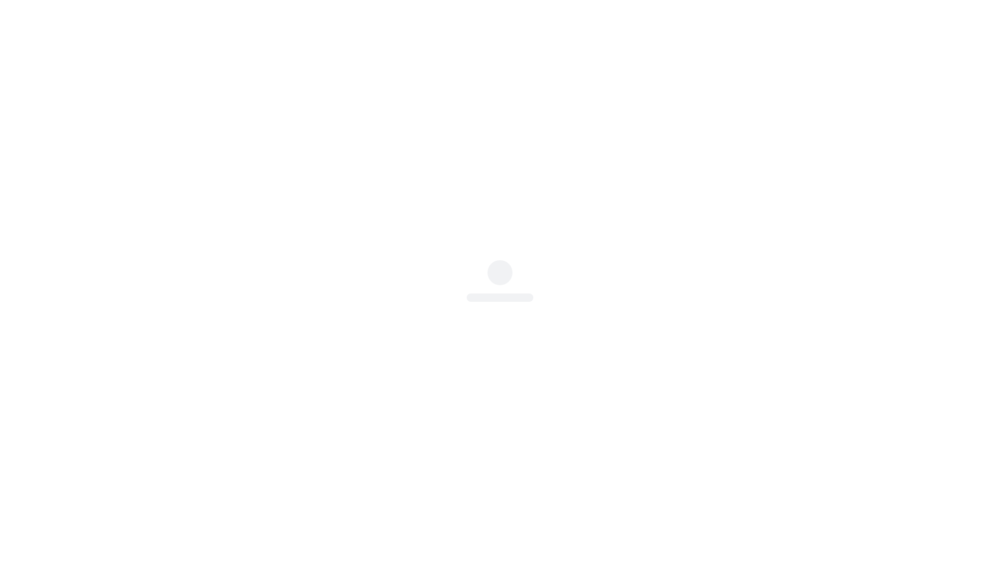
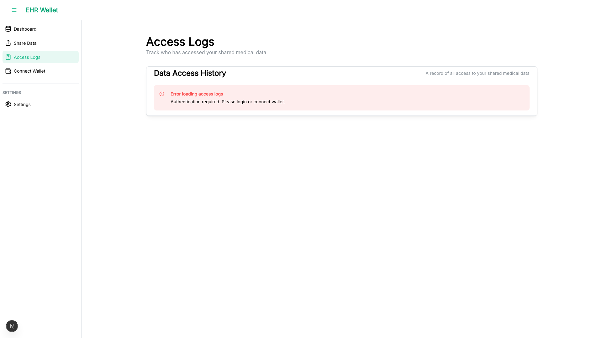

# EHR Wallet App Walkthrough

A visual guide to help you get started with the EHR Wallet application.

> **Note**: These screenshots show demo data. Wallet addresses and sensitive information are from test environments.

---

## 1. Login Page

The login page offers two authentication options:

- **Web3 Wallet Login**: Connect using MetaMask or any Web3 wallet
- **Email/Password Login**: Traditional authentication (demo: `patient@example.com` / `password`)

The page also displays the current blockchain network status.

---

## 2. Patient Dashboard - Shared Data

The main dashboard shows four tabs:

- **Shared Data**: Manage medical records you've shared with others
- **Health Data**: Connect Apple Health and view health metrics
- **Appointments**: View and manage medical appointments
- **Medical Records**: Coming soon

---

## 3. Patient Dashboard - Health Data

Connect Apple Health (iOS) to sync your health metrics:

- Steps walked
- Heart rate
- Sleep hours
- Blood pressure

Click "Connect Apple Health" to link your health data.

---

## 4. Patient Dashboard - Appointments

View and manage medical appointments:

- **Today**: Appointments scheduled for today
- **Upcoming**: Future appointments
- **Past**: Historical appointments
- **All**: Complete appointment history

Click "New Appointment" to schedule a new visit.

---

## 5. Wallet Connection

Manage your blockchain wallet:

- View connected wallet address
- See current network (Polygon Amoy Testnet)
- Copy address to clipboard
- View on block explorer
- Disconnect wallet

Your wallet is used to securely sign and manage access to your medical data.

---

## 6. Share Medical Data

Share your medical records securely:

1. **Select Data Types**: Choose what to share (lab results, imaging, prescriptions, etc.)
2. **Upload Documents**: Upload medical files to IPFS
3. **Set Duration**: Choose how long the share link is valid
4. **Add Password** (optional): Add extra protection with a password
5. **Share**: Generate a secure link to share with healthcare providers

---

## 7. Access Logs

Track who has accessed your shared medical data:

- View access history
- See when data was accessed
- Monitor access count
- Revoke access when needed

---

## Getting Started

1. **Connect Wallet**: Click "Connect with MetaMask" on the login page
2. **Navigate Dashboard**: Use the sidebar to access different features
3. **Share Data**: Go to "Share Your Medical Data" to create a secure share link
4. **Monitor Access**: Check "Access Logs" to see who has viewed your data

---

## Security Features

- **Blockchain Verification**: All access grants are verified on-chain
- **IPFS Storage**: Medical data is stored on decentralized IPFS
- **Password Protection**: Optional password for additional security
- **Time-Limited Access**: Shares automatically expire
- **Access Logging**: Full audit trail of who accessed what data
